# Architecture

**manual.email is a humanist email client** — open source, calm, and built for
people rather than for engagement metrics. The product goal shapes the
engineering: mail must arrive exactly once, route predictably, and never get
silently dropped, so the system is small, legible, and unsurprising.

It is a Bun monorepo. Inbound and outbound mail run on Cloudflare Email Service
— ingress receives via Email Routing, egress sends via Email Sending — handled
by two single-purpose Workers decoupled by Cloudflare Queues. Shared schema and
wire contracts live in `packages/*` so the workers never duplicate a type or a
query.

## Topology

| Workspace | Role |
| --- | --- |
| `apps/web` | Next.js 16 UI, served on Cloudflare via vinext (Vite). Its compose route validates outbound mail and produces to `EGRESS_QUEUE`. |
| `apps/ingress` | Receives mail (Email Routing `email()`), enqueues it, then consumes the ingress queue: idempotency → recipient resolution → route. |
| `apps/egress` | Consumes the egress queue and sends outbound mail through Cloudflare Email Service (`SEND_EMAIL` binding). |
| `packages/db` | Drizzle schema (single source of truth), the typed `createDb` client, R2 key helpers, and address parsing. |
| `packages/contracts` | oRPC + `zod/mini` queue-payload contracts. The contract is the source of truth; worker message types are inferred from it. |
| `appraise` | Bun/TS guardrail enforcing the 350-line file ceiling. |

## Data flow

```mermaid
flowchart LR
  MX[Email Routing] -->|email&#40;&#41;| IN[ingress worker]
  IN -->|INGRESS_QUEUE| INQ[(manual-email-ingress)]
  INQ --> INC[ingress queue consumer]
  INC -->|deliver: persist| D1[(D1 manual-email)]
  WEB[web worker] -->|compose → EGRESS_QUEUE| EGQ[(manual-email-egress)]
  EGQ --> EG[egress worker] -->|SEND_EMAIL| OUT[outbound mail]
  IN -.raw MIME.-> R2[(R2 manual-email-messages)]
  INC -.retries exhausted.-> DLQ[(*-dlq)]
  DLQ -->|drain| D1
```

Email Routing invokes `email()` **once per recipient**, so the same message can
arrive several times with identical bytes. On each invocation ingress resolves
the recipient, streams the raw MIME to R2 under that owner's prefix (or a shared
`unresolved/` one), and enqueues a metadata payload carrying a deterministic,
recipient-scoped message id. The queue consumer is the single chokepoint that
decides what is new: it dedupes on that id, then writes the `messages` row that
makes the mail show up in the mailbox. The id doubles as the row key and the R2
object id, so retries and redeliveries converge on one row/object.

**ingress never sends mail.** It receives, persists to the mailbox, and decides;
egress is the single egress point for everything outbound. Anything that needs
sending is enqueued on `EGRESS_QUEUE` rather than sent inline — today that is
user-composed mail from the web app. Egress consumes the queue and hands each
message to Cloudflare Email Service via the structured `SEND_EMAIL.send({ from,
to, subject, text, html })` builder (plain `text` required, `html` optional); it
acks on success and retries on failure so nothing outbound is silently dropped.
It never assembles MIME or uses Email Routing's verified-only send.

When a consumer exhausts its retries, the message is moved to that queue's
dead-letter queue (`<queue>-dlq`). Each worker also consumes its own DLQ and
drains it into the `dead_letters` table — so a code-path failure quarantines
mail for inspection instead of dropping it. The DLQ path does trivial work
(persist + ack), never the failing logic, and has no DLQ of its own.

## Storage

- **D1 `manual-email`** — `accounts`, `addresses` (recipient → account
  resolution), `messages`, `processed_messages` (the idempotency ledger), and
  `dead_letters` (failed messages drained from the DLQs). `apps/ingress` owns
  the migrations (`packages/db/migrations`); both workers bind the database as
  `DB`. Accounts and their addresses are provisioned with
  `apps/ingress/scripts/seed.ts` (`bun run --filter @manual.email/ingress seed`),
  a stop-gap registration path that canonicalises each address through the same
  `parseAddress` used by resolution until the web app owns sign-up.
- **R2 `manual-email-messages`** — raw MIME bodies, keyed via the helpers in
  `packages/db`: `messages/<accountId>/<messageId>.eml` for a delivered message,
  `unresolved/<messageId>.eml` when the recipient didn't resolve. Metadata stays
  in D1.

## Contracts & validation

`packages/contracts` defines the queue payloads once. Workers import the
**types** (erased at build time), so trusted internal queue messages carry no
runtime cost. The exceptions are the two trust boundaries where untrusted data
enters: `ingress.email()` parses the constructed payload with
`inboundMessageSchema` before enqueuing, and the web compose route validates the
user-supplied body with `outboundMessageSchema` before producing to
`EGRESS_QUEUE`. Schemas use `zod/mini` to keep those bundled validators small.

## Idempotency & resolution

- **Idempotency key** is recipient-scoped: `<canonicalRecipient>|mid:<id>` or
  `<canonicalRecipient>|sha256:<body-hash>`. Scoping by recipient is essential —
  an unscoped key would drop every recipient after the first. The consumer skips
  keys already in `processed_messages` and records a key only **after** a
  terminal routing decision, so a retry re-runs rather than silently losing mail.
- **Resolution** matches the canonical recipient against `addresses`
  (first-party manual.email addresses only); `+tag` sub-addressing resolves to
  the base address. It runs twice for different purposes: `email()` resolves to
  choose the R2 prefix the body is written under, and the consumer resolves
  again — authoritatively — to set the `messages` row's owning account.

## Ports

| Service | Dev port | Inspector |
| --- | --- | --- |
| web | 10120 | — |
| ingress | 10130 | 10131 |
| egress | 10140 | 10141 |

## Commands

- `bun run dev` — run every workspace; `dev:web` / `dev:ingress` / `dev:egress`
  for one.
- `bun run check` — the full gate: Biome + typecheck (regenerates worker types
  first) + Knip + appraise.
- `bun run db:generate` — regenerate migrations from the Drizzle schema;
  `db:migrate:local` / `db:migrate` to apply.
- Local inbound test: `apps/ingress/test/send.sh` POSTs to
  `/cdn-cgi/handler/email` (see Email Routing local-dev docs).
