# Architecture

**manual.email is a humanist email client** — open source, calm, and built for
people rather than for engagement metrics. The product goal shapes the
engineering: mail must arrive exactly once, route predictably, and never get
silently dropped, so the system is small, legible, and unsurprising.

It is a Bun monorepo. Inbound and outbound mail run on Cloudflare Email Service
— ingress receives via Email Routing, egress sends via Email Sending — handled
by two single-purpose Workers decoupled by Cloudflare Queues. Shared schema,
wire contracts, and UI primitives live in `packages/*` so apps never duplicate
types, query shapes, or baseline interface chrome.

## Topology

| Workspace | Role |
| --- | --- |
| `apps/web` | Next.js 16 UI, served on Cloudflare via vinext (Vite). BetterAuth username+password sign-in (the username is the address local-part — no email collected); every mutation is a server action (no API routes). Compose validates outbound mail and produces to `EGRESS_QUEUE`. |
| `apps/ingress` | Receives mail (Email Routing `email()`), enqueues it, then consumes the ingress queue: idempotency → recipient resolution → **filter** (a per-message Sandbox program returns a verdict) → deliver. Re-exports the `Sandbox` Durable Object. |
| `apps/egress` | Consumes the egress queue and sends outbound mail through Cloudflare Email Service (`SEND_EMAIL` binding). |
| `packages/db` | Drizzle schema (single source of truth), the typed `createDb` client, R2 key helpers, and address parsing. |
| `packages/contracts` | oRPC + `zod/mini` queue-payload contracts. The contract is the source of truth; worker message types are inferred from it. |
| `packages/ui` | Shared React primitives for the web app: class composition, cva variants, buttons, inputs, panels, notices, chips, and page chrome. Tailwind stays utility-first and intentionally basic. |
| `appraise` | Bun/TS guardrail enforcing the 350-line file ceiling. |

## Data flow

```mermaid
flowchart LR
  MX[Email Routing] -->|email&#40;&#41;| IN[ingress worker]
  IN -->|INGRESS_QUEUE| INQ[(manual-email-ingress)]
  INQ --> INC[ingress queue consumer]
  INC -->|filter| SBX[Sandbox: filter program]
  SBX -.managed.-> GEM[Gemini Flash Lite]
  INC -->|deliver + verdict| D1[(D1 manual-email)]
  WEB[web worker] -->|compose → EGRESS_QUEUE| EGQ[(manual-email-egress)]
  EGQ --> EG[egress worker] -->|SEND_EMAIL| OUT[outbound mail]
  IN -.raw MIME.-> R2[(R2 manual-email-messages)]
  INC -.read body.-> R2
  INC -.retries exhausted.-> DLQ[(*-dlq)]
  DLQ -->|drain| D1
```

Email Routing invokes `email()` **once per recipient**, so the same message can
arrive several times with identical bytes. On each invocation ingress resolves
the recipient, streams the raw MIME to R2 under that owner's prefix (or a shared
`unresolved/` one), and enqueues a metadata payload carrying a deterministic,
recipient-scoped message id. The queue consumer is the single chokepoint that
decides what is new: it dedupes on that id, **filters** the mail (below), then
writes the `messages` row — with its verdict — that makes the mail show up in
the mailbox. The id doubles as the row key and the R2 object id, so retries and
redeliveries converge on one row/object.

**ingress never sends mail.** It receives, persists to the mailbox, and decides;
egress is the single egress point for everything outbound. Anything that needs
sending is enqueued on `EGRESS_QUEUE` rather than sent inline — today that is
user-composed mail from the web app. Egress consumes the queue and hands each
message to Cloudflare Email Service via the structured `SEND_EMAIL.send({ from,
to, subject, text, html })` builder (plain `text` required, `html` optional); it
acks on success and retries on failure so nothing outbound is silently dropped.
It never assembles MIME or uses Email Routing's verified-only send.

When a consumer exhausts its retries, the message is moved to that queue's
dead-letter queue (`<queue>-dlq`). Each worker also consumes its own DLQ and
drains it into the `dead_letters` table — so a code-path failure quarantines
mail for inspection instead of dropping it. The DLQ path does trivial work
(persist + ack), never the failing logic, and has no DLQ of its own.

## Storage

- **D1 `manual-email`** — the mail tables (`accounts`, `addresses` for recipient
  → account resolution, `messages`, `processed_messages` idempotency ledger,
  `dead_letters`), the filtering tables (`tags` + `message_tags`, `trays` +
  `tray_tags`, `message_verdicts`, `filter_configs`), plus BetterAuth's
  `user`/`session`/`account`/`verification` tables (web auth). `packages/db` owns
  the migrations
  (`packages/db/migrations`); all three workers bind the database as `DB`.
  Sign-up is owned by the web app (see below); `apps/ingress/scripts/seed.ts`
  (`bun run --filter @manual.email/ingress seed`) remains for provisioning
  accounts/addresses out-of-band, canonicalising through the same `parseAddress`
  used by resolution.
- **R2 `manual-email-messages`** — raw MIME bodies, keyed via the helpers in
  `packages/db`: `messages/<accountId>/<messageId>.eml` for a delivered message,
  `unresolved/<messageId>.eml` when the recipient didn't resolve. Metadata stays
  in D1.

## Contracts & validation

`packages/contracts` defines the queue payloads once. Workers import the
**types** (erased at build time), so trusted internal queue messages carry no
runtime cost. The exceptions are the two trust boundaries where untrusted data
enters: `ingress.email()` parses the constructed payload with
`inboundMessageSchema` before enqueuing, and the web compose **server action**
validates the user-supplied body with `composeRequestSchema` (deriving `from`
from the authenticated session, not the client) before mapping it onto
`outboundMessageSchema` and producing to `EGRESS_QUEUE`. Schemas use `zod/mini`
to keep those bundled validators small. A third boundary is the filter program's
output: `filterVerdictSchema` validates the verdict a Sandbox program returns
(untrusted, especially for custom programs) before it is persisted, while
`filterInputSchema` shapes what the program sees.

## Web app & auth

`apps/web` authenticates with **BetterAuth** (username + password) over the shared
D1 via the Drizzle adapter; its four tables live in `packages/db` next to the
mail schema. Sign-up collects only a username — no email — and derives the
account's first-party address from it (`<username>@manual.email`), so auth
identity and mailbox identity are the same handle. Every mutation —
sign-in/up/out and compose — is a **Next.js server action**, so there are no API
routes (the `nextCookies()` plugin lets actions set the session cookie). Sign-up
auto-provisions the user's mailbox: a `databaseHooks.user.create.after` hook
resolves the derived address into an `accounts` row + primary `addresses` row
through `parseAddress`, and seeds that account's default tags, trays, and managed
filter config. That resolution is idempotent and is re-run lazily by
`/inbox` and compose, keeping auth identity and mail identity one-to-one. Because
compose derives `from` from the session, the web app is not an open relay.

## Idempotency & resolution

- **Idempotency key** is recipient-scoped: `<canonicalRecipient>|mid:<id>` or
  `<canonicalRecipient>|sha256:<body-hash>`. Scoping by recipient is essential —
  an unscoped key would drop every recipient after the first. The consumer skips
  keys already in `processed_messages` and records a key only **after** a
  terminal routing decision, so a retry re-runs rather than silently losing mail.
- **Resolution** matches the canonical recipient against `addresses`
  (first-party manual.email addresses only); `+tag` sub-addressing resolves to
  the base address. It runs twice for different purposes: `email()` resolves to
  choose the R2 prefix the body is written under, and the consumer resolves
  again — authoritatively — to set the `messages` row's owning account.

## Filtering

Between resolution and delivery the consumer runs the account's **filter
program** over `{ subject, sender, body, html }` (`body` = plain text extracted
from the R2 MIME, `html` = decoded HTML body when present) and stores a 1:1
verdict. A `pass` carries `tags`; a `reject` carries a `category`
(`spam`/`phishing`/`other`) + `reason`. **Quarantine is derived, not a folder**
— rejected mail still gets a `messages` row, surfaced in the Quarantine tray.
Tags and trays are the organising primitives: a tray is a saved view over one or
more tags, except the always-present `everything` (passed mail) and `quarantine`
(rejected mail) views. Editable tag trays also carry their display color and
Phosphor icon name. Sign-up seeds the reserved `important`/`unimportant` tags,
their trays, and a managed config.

Every message runs in a **Cloudflare Sandbox** (`bun`, internet access, with
`ai`, `@ai-sdk/google`, and `zod` preinstalled). One harness drives both modes:
it writes the shared `filter-contract.ts`, the managed source or the user's
custom `main.ts` default export, the input, and the runner into a fresh dir. The
runner validates input and verdicts at the same boundary custom programs can
import as `FilterProgram`. **Managed** runs receive `GEMINI_FLASH_LITE` — the
built-in program classifies via AI SDK structured output on
`gemini-flash-lite-latest`, steered by two editable prompts: `safety_prompt`
for pass/reject policy and `tag_prompt` for Important/Unimportant tagging. The
product should recommend editing `tag_prompt`; changing `safety_prompt` changes
the sender-facing rejection contract. **Custom** runs get no first-party secrets
and a different sandbox id, so a custom program can never share a container with
a key-bearing managed run.

The failure policy is mode-aware so an outage never mass-quarantines real mail: a
valid verdict is used as-is; a **custom** non-verdict fails closed to Quarantine
(the user's program is the sender-facing contract); a **managed** non-verdict —
or any infrastructure error (Sandbox unreachable, R2 read, body missing) — throws
so the queue retries and, if exhausted, the message lands in the DLQ for
inspection rather than being mislabelled. Filtering is gated on an existing
verdict, so a retry that already filtered just re-delivers.

## Ports

| Service | Dev port | Inspector |
| --- | --- | --- |
| web | 10120 | — |
| ingress | 10130 | 10131 |
| egress | 10140 | 10141 |

## Commands

- `bun run dev` — run every workspace; `dev:web` / `dev:ingress` / `dev:egress`
  for one.
- `bun run check` — the full gate: Biome + typecheck (regenerates worker types
  first) + Knip + appraise.
- `bun run db:generate` — regenerate migrations from the Drizzle schema;
  `db:migrate:local` / `db:migrate:prod` to apply.
- Local inbound test: `apps/ingress/test/send.sh` POSTs to
  `/cdn-cgi/handler/email` (see Email Routing local-dev docs).

## Deploying

`bun run deploy` (or `deploy:web` / `deploy:ingress` / `deploy:egress`) applies
any **pending remote D1 migrations first**, then deploys the worker(s). D1
migrations are tracked and idempotent, so this is a no-op when nothing is
pending — but it means prod can never run against an unmigrated schema. Because
deploy applies migrations, review generated migrations before shipping.

Prod auth needs these set once per worker via `wrangler secret put` (run in the
worker's dir, e.g. `apps/web`): `BETTER_AUTH_SECRET` and `BETTER_AUTH_API_KEY`
(web). `BETTER_AUTH_URL` is a committed var in `apps/web/wrangler.jsonc`, not a
secret. Missing either secret makes Better Auth 500 every `/api/auth/*` route.
`apps/ingress` likewise needs `GEMINI_FLASH_LITE` for the managed filter program
(locally from `.dev.vars`). Its Sandbox container (`apps/ingress/Dockerfile`,
bound as the `Sandbox` Durable Object) requires the Workers **Paid** plan +
Containers in prod, and Docker running for local dev.

All workers share one local state dir (`.wrangler/state`, via `--persist-to` /
the web plugin's `persistState`) so they read/write the same D1 + R2 in dev.
Local Queues do **not** cross separate dev processes, so a web→egress send is
only exercisable up to the enqueue locally; inbound→inbox is fully local (ingress
is producer and consumer in one process). The root `kysely` override pins a
dual-ESM/CJS build so vinext's dep optimizer can boot BetterAuth.
